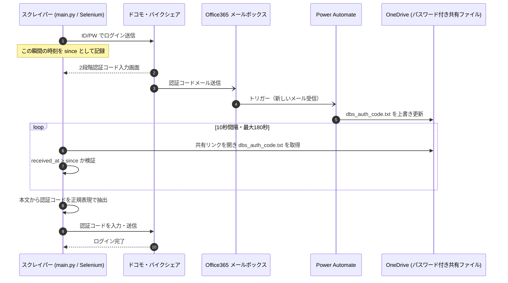

# メール2段階認証コード連携 仕様書（Power Automate → OneDrive → スクレイパー）

ドコモ・バイクシェアのシステム刷新により導入されたメール2段階認証に対応するための、
認証コード受け渡し経路の仕様書です。

- 作成日: 2026-08-01
- 前提: 認証コードは Office 365（Exchange Online）のメールボックスに届く
- 決定事項: OneDrive のローカル同期は使用不可のため、**パスワード付き共有リンク経由でオンラインから読み取る**方式とする
- 旧計画 `docs/sms-auth-implementation-plan.md`（Gmail API 前提）は本書で置き換える

---

## 1. 全体構成



**役割分担の原則**: Power Automate は「運搬」だけを担当し、**コードの抽出（パース）は Python 側で行う**。
Power Automate の式は正規表現を持たず文字列操作が脆いため、メール文面の細かな変更に耐えられないためです。

---

## 2. 事前準備（Power Automate フロー作成前に一度だけ）

1. OneDrive for Business 上に受け渡し専用フォルダを作成する
   - 推奨パス: `/DBS認証コード/`
   - **他の業務ファイルと同居させない**（共有リンクの露出範囲を最小化するため）
2. そのフォルダ内に、空のテキストファイルを1つ作成する
   - ファイル名: **`dbs_auth_code.txt`**（固定名・以後この1ファイルを上書きし続ける）
   - 文字コード: UTF-8
   - 中身: 空でよい
3. `dbs_auth_code.txt` **単体**に対して共有リンクを発行する
   - 種類: 「リンクを知っているすべてのユーザー」
   - **パスワードを設定する**（必須）
   - **有効期限を設定する**（推奨: 90日など。期限切れ時は再発行して `.env` を更新）
   - 権限: **表示のみ**（編集不可にする）
   - フォルダではなくファイル単体を共有する。フォルダを共有するとフォルダ内の全ファイルが露出するため

> [!IMPORTANT]
> 手順1〜3は**あなた（人間）の作業**です。発行された共有リンクとパスワードは認証情報にあたるため、
> チャットやログに貼らず、`.env` に直接記入してください（`.env` は git 管理外です）。

---

## 3. Power Automate フロー仕様

フロー名（推奨）: `DBS-2段階認証コード受け渡し`

### 3.1 トリガー

| 項目 | 設定値 |
|------|--------|
| コネクタ | Office 365 Outlook |
| アクション | **新しいメールが届いたとき (V3)** |
| フォルダー | `受信トレイ`（振り分けルールがある場合はその移動先フォルダ） |
| 差出人 | 認証コードメールの送信元アドレス（**要確認**：後述の未確定事項） |
| 件名フィルター | 認証コードメールの件名に必ず含まれる文字列（例: `認証コード`） |
| 添付ファイルを含める | いいえ |
| 重要度 | 任意 |
| 本文のみを取得 | いいえ（本文全体が必要） |

> 差出人と件名の**両方**でフィルタすること。片方だけだと無関係なメールでファイルが上書きされ、
> 古い／誤ったコードを掴む事故につながります。

### 3.2 アクション：ファイルの上書き更新

| 項目 | 設定値 |
|------|--------|
| コネクタ | OneDrive for Business |
| アクション | **ファイルの更新**（"ファイルの作成" ではない） |
| ファイル | 事前準備で作成した `/DBS認証コード/dbs_auth_code.txt` をファイルピッカーで選択 |
| ファイル コンテンツ | 下記 3.3 のテキスト |

> [!WARNING]
> 「ファイルの作成」を使うと、同名ファイルが存在する場合に `dbs_auth_code (1).txt` のように
> 自動リネームされ、スクレイパーが永遠に古いファイルを読み続けます。
> **必ず「ファイルの更新」を使い、固定の1ファイルを上書きしてください。**

### 3.3 ファイル コンテンツの書式

> [!NOTE]
> **2026-08-02 現在、実際に稼働しているフローは「メール本文だけ」を書き出す構成です。**
> スクレイパー側はこの素の形式にも対応済みで、そのままで動作します（疎通確認済み）。
> 受信時刻は共有ファイルの HTTP `last-modified`、コードの同一性判定は `etag` で代用しています。
> 以下の拡張形式は**必須ではなく、将来の堅牢化オプション**です。
> `fetch()` 経路が使えなくなった場合（＝ `last-modified` が取れなくなった場合）に必要になります。

以下を**そのままの行構造**で設定します（`〔〕` の部分は動的コンテンツ／式に置き換え）。

```
X-RECEIVED-AT: 〔受信日時〕
X-SUBJECT: 〔件名〕
X-FROM: 〔差出人〕
X-MESSAGE-ID: 〔メッセージ ID〕
X-WRITTEN-AT: 〔式: utcNow()〕
X-BODY-BEGIN
〔本文のプレビュー〕
----
〔本文〕
X-BODY-END
```

差し込む動的コンテンツ（トリガー「新しいメールが届いたとき (V3)」の出力）:

| プレースホルダ | 動的コンテンツ名 | 補足 |
|----------------|------------------|------|
| 〔受信日時〕 | `受信日時` (`receivedDateTime`) | UTC の ISO8601（末尾 `Z`）。**必須** |
| 〔件名〕 | `件名` (`subject`) | ログ・照合用 |
| 〔差出人〕 | `差出人` (`from`) | ログ・照合用 |
| 〔メッセージ ID〕 | `メッセージ ID` (`id`) | 同一コードの二重消費防止に使用 |
| 〔式: utcNow()〕 | 式 `utcNow()` | フロー実行時刻。受信日時が取れない場合の代替 |
| 〔本文のプレビュー〕 | `本文のプレビュー` (`bodyPreview`) | **プレーンテキスト**。通常はここにコードが含まれる |
| 〔本文〕 | `本文` (`body`) | HTML の可能性あり。プレビューで取れない場合の保険 |

**JSON ではなく行区切りテキストにしている理由**: Power Automate の文字列連結は引用符・改行を
エスケープしないため、メール本文をそのまま JSON に埋めると壊れた JSON が生成されます。
この行区切り形式なら本文に何が入っても破綻しません。

### 3.4 （任意）後処理

- 認証コードメールを既読にする／専用フォルダへ移動する
- 本仕様では必須ではありません（スクレイパー側が `X-RECEIVED-AT` と `X-MESSAGE-ID` で
  新鮮さと二重消費を判定するため）

---

## 4. スクレイパー側の読み取り仕様

実装先: `src/mail_code_client.py`（新規）

### 4.1 公開インターフェース

```python
wait_for_auth_code(since: datetime, timeout_sec: int = 180) -> str
```

- `since`: ログインフォームを送信した時刻（`datetime.now(timezone.utc)`）
- 戻り値: 抽出した認証コード文字列
- 例外: タイムアウト時は `AuthCodeTimeout`

### 4.2 取得処理

`OneDriveShareReader` がブラウザを**1回だけ起動・解錠し、ポーリング中は解錠済みセッションを使い回します**。
毎回リンクを開き直すと1回15〜30秒かかり180秒のタイムアウトに数回しか試行できないためです。

1. `.env` の共有リンクを Selenium で開く（**初回のみ**）
2. パスワード入力画面が出た場合はパスワードを入力して送信（**初回のみ**）
   （`upload_to_onedrive_web()` と同一のセレクタ群を再利用）
3. 共有 URL に `download=1` を付けた URL を、解錠済みページ内から `fetch()` して本文を直接取得
4. `fetch()` が使えない場合のフォールバックとして、専用の一時フォルダへ実ファイルをダウンロードし
   UTF-8（BOM許容）で読み取り
5. 取得内容が受け渡しファイルの書式でない場合（＝ログイン画面等の HTML が返った場合）は
   `debug/mailcode_error_*.png` / `.html` を保存してエラーとする
6. 10 秒待って 3 から再試行（タイムアウトまで）。**2回目以降のポーリングは数秒で完了します**

### 4.3 受信時刻と同一性の判定

受け渡しファイルの形式によって判定材料が変わるため、次の優先順で解決します。

| 用途 | 優先順位 |
|------|----------|
| 受信時刻 | 1. `X-RECEIVED-AT`（タイムゾーン付きの場合のみ）→ 2. `X-WRITTEN-AT` → 3. 共有ファイルの HTTP `last-modified` |
| コードの同一性 | 1. `X-MESSAGE-ID` → 2. 共有ファイルの `etag`（更新のたびに版数が上がる）→ 3. 受信時刻 |

**現在の稼働構成（メール本文のみ）では 3 と 2 が使われます。**
どれも得られない場合は、古い認証コードを使ってしまう危険があるため**エラーで中断**します
（タイムゾーン不明の時刻を推測で解釈することはしません）。

### 4.4 受理条件（すべて満たす場合のみコードを採用）

| 条件 | 内容 |
|------|------|
| 新鮮さ | `受信時刻 >= ログイン送信時刻 - 60秒`（クロックずれ許容） |
| 有効期限 | `now - 受信時刻 <= 600秒`（既定値・`.env` で変更可） |
| 未消費 | 同一性の値がローカル状態ファイルの最終消費値と異なる |
| 抽出成功 | 本文から認証コードを1つに特定できる |

採用したら同一性の値をローカル状態ファイル（`output/last_auth_code.json`）に記録し、
同じコードの再利用を防ぎます。

### 4.5 コード抽出ロジック

1. `X-BODY-BEGIN`〜`X-BODY-END` の内容を取り出す
2. HTML タグが含まれる場合は除去してプレーンテキスト化
3. `認証コード` / `確認コード` / `ワンタイム` / `verification code` などのキーワード**近傍**にある
   4〜8桁の連続数字を優先的に採用
4. 見つからない場合、テキスト全体で「単独で現れる4〜8桁の数字」が**ちょうど1つ**なら採用
5. 複数候補があり一意に定まらない場合はエラーとし、本文をログに残さず件数のみ記録

抽出パターンは `.env` の `DBS_MAILCODE_REGEX` で上書き可能とします。

### 4.6 `.env` 追加項目

```
DBS_MAILCODE_SHARE_LINK=      # パスワード付き共有リンク（dbs_auth_code.txt 単体）
DBS_MAILCODE_SHARE_PASSWORD=  # 上記リンクのパスワード
DBS_MAILCODE_TIMEOUT_SEC=180  # コード待機のタイムアウト
DBS_MAILCODE_POLL_SEC=10      # ポーリング間隔
DBS_MAILCODE_MAX_AGE_SEC=600  # コードの有効とみなす経過秒数
DBS_MAILCODE_CLOCK_SKEW_SEC=60 # 受信時刻とローカル時計のずれの許容秒数
DBS_MAILCODE_REGEX=           # 空なら既定の抽出ロジックを使用
```

あわせて、刷新後の新ログイン画面URL用に `DBS_LOGIN_URL` を追加しています。
未設定の場合は従来の `DBS_TOP_PAGE` / `DBS_WORKER_TOP_PAGE` にフォールバックします。

---

## 5. セキュリティ上の留意点

- 共有リンクは**匿名アクセス + パスワード**です。リンクとパスワードの両方が漏れると、
  第三者が認証コードを閲覧できます。ただし DBS の ID/パスワードは含まれないため、
  それ単独ではログインできません。
- 露出面を最小化するため、共有対象は**ファイル1個のみ・表示権限のみ・有効期限あり**とします。
- `dbs_auth_code.txt` には常に「直近1通ぶんの認証コードメール本文」だけが存在します。
  履歴は蓄積されません。
- 共有リンク・パスワードは `.env` にのみ保持し、コード・ログ・ドキュメント・git に書きません。
- スクレイパーのログには認証コード本体を出力しません（桁数と受信時刻のみ記録）。

---

## 6. 制約と既知のリスク

| 項目 | 内容 | 対応 |
|------|------|------|
| 取得の遅さ | 共有リンクのパスワード解除で初回15〜30秒 | ブラウザを起動しっぱなしにして解錠は1回だけ行い、2回目以降のポーリングは数秒にする |
| Power Automate の遅延 | 標準フローのメールトリガーは即時ではなく数十秒〜数分遅れることがある | タイムアウトを180秒に設定。実測後に調整 |
| OneDrive Web UI の変更 | Microsoft 側の UI 変更でセレクタが壊れる可能性 | 失敗時に `debug/` へスクリーンショットと HTML を保存（既存実装と同じ方式） |
| 共有リンクの期限切れ | 期限到来でリンクが無効化される | 期限を暦に登録し、更新時に `.env` を差し替える |

---

## 7. 未確定事項（本仕様を確定するために必要な情報）

以下は刷新後の実システムを確認しないと決められません。

### 7.1 メール側

- [x] **本文**での認証コードの書かれ方 — 2026-08-02 実測で判明。HTML メールで
      `docomo bike share 管理ポータルの認証コードをお知らせします。` に続けて
      `認証コード：<b>977832</b>` の形式。**6桁**。
      本文中の「証」が数値文字参照 `&#35388;` で書かれている点に注意
      （`html.unescape` で復元してからキーワード照合しています）。
      この実物を `tests/test_mail_code_client.py` に回帰テストとして固定済み。
- [ ] 認証コードメールの**送信元アドレス**（Power Automate のフィルタ条件を絞るために推奨）
- [ ] **件名**の文字列（同上）
- [ ] コードの**有効期限**（何分で失効するか。`DBS_MAILCODE_MAX_AGE_SEC` の既定値600秒を実測に合わせる）

### 7.2 サイト側

- [ ] 新ログイン画面の URL と入力欄の要素名（現行は `Account` / `Password`）
- [ ] 2段階認証コード入力画面の要素名・送信ボタン
- [ ] **2段階認証が発生する条件**（毎回か／新しい端末・IP のときだけか）
- [ ] 「この端末を信頼する」に相当するオプションの有無
- [ ] セッション管理方式（Cookie ベースか、現行同様の hidden `SessionID` ベースか）
- [ ] エリア選択画面・車両情報画面の HTML 構造の変更点

---

## 8. 巡回・セッション方式の決定（2026-08-01 決定）

### 決定事項

1. **エリア一括取得に切り替える。** 新サイトは全エリアを一括で取得できるため、
   現行の「エリアごとにログアウト→再ログイン」（6エリア＝1日約1,700回ログイン）は廃止し、
   **1回のログインで全エリアを取得する**構成に作り替える。
2. **2段階認証を不要に発生させないことを最優先とする。** 優先順位は次のとおり。
   - **第1候補: ログインセッションの外部保持**（都度起動のまま、セッションをファイルに保存・復元）
   - **第2候補: 常駐化**（第1候補が成立しない場合）

### 第1候補：セッションの外部保持（都度起動を維持）

`src/session_store.py`（新規）で、ログイン成功時にブラウザのセッション情報を
`output/dbs_session.json` へ保存し、次回起動時に復元します。

- 保存対象: Cookie 全件 ＋ `localStorage` / `sessionStorage`
- 起動時の流れ:
  1. 保存済みセッションがあれば復元し、認証済み判定用のページに遷移して有効性を確認
  2. 有効ならログイン処理と2段階認証を**まるごとスキップ**
  3. 無効なら通常ログイン → 2段階認証（本書の経路） → 成功後にセッションを保存し直す
- メリット: 現行のタスクスケジューラ運用（5分ごと都度起動）をそのまま維持できる。
  プロセスがハングしても次回起動で自然復旧する。
- 成立条件: 新サイトが **Cookie ベースのセッション管理**であること。
  現行システムのように HTML の hidden パラメータ `SessionID` に依存する方式だと成立しない。
- セキュリティ: `output/dbs_session.json` は**ログイン済みセッションそのもの**であり、
  実質的に認証情報と同等の価値を持つ。git 管理外とし、外部へ送信・アップロードしない。

### 第2候補：常駐化（第1候補が成立しない場合）

Python プロセスと Chrome を起動したままにし、同一タブ内で5分ごとにページ遷移して取得します。

- メリット: セッションがメモリ上に維持されるため、2段階認証の発生頻度が最小になる
- デメリット: Chrome / WebDriver のハングアップ検知と自動再起動、メモリリーク対策が必要
- 必要な追加実装:
  - 常駐ループと、既存のタスクスケジューラ起動からの移行
  - ヘルスチェック（一定回数連続失敗でブラウザを作り直す）
  - 起動時の自動復帰（Windows のスタートアップ or タスクスケジューラの「起動時に実行」）
  - 二重起動防止のロックファイル

### どちらになるかの判定方法

セクション7.2 の実機調査で以下を確認して決めます。

1. ログイン後に `document.cookie` とブラウザの Cookie 一覧にセッション識別子があるか
2. ページの `<form>` に hidden の `SessionID` 相当が残っていないか
3. Cookie を保存 → ブラウザを完全終了 → 復元して認証済みページに直接アクセスできるか

3 が成功すれば第1候補、失敗すれば第2候補に確定します。

---

## 9. 実装ステップ

| # | 内容 | 担当 | 状態 |
|---|------|------|------|
| 1 | 本仕様書の作成 | Claude | **完了** |
| 2 | `src/mail_code_client.py` の実装とユニットテスト（45件） | Claude | **完了** |
| 3 | OneDrive 受け渡しファイルと共有リンクの準備（本書セクション2） | 人間 | **完了** |
| 4 | Power Automate フローの作成（本書セクション3） | 人間 | **完了**（本文のみを書き出す構成） |
| 5 | 共有リンク経由の取得疎通テスト（`python -m src.mail_code_client`） | 人間 + Claude | **完了**（2026-08-02 実コードの抽出に成功） |
| 6 | 新システムの実機調査（画面構造・2FA発生条件・セッション方式） | 人間立ち会い + Claude | 未着手 |
| 7 | `src/session_store.py` の実装（セッション外部保持。セクション8 第1候補） | Claude | 未着手（#6 待ち） |
| 8 | `src/auth.py` の新ログイン・2FA 対応 | Claude | 未着手（#6 待ち） |
| 9 | エリア一括取得への作り替え（`main.py` / `src/scraper.py`） | Claude | 未着手（#6 待ち） |
| 10 | 常駐化（#7 が成立しなかった場合のみ） | Claude | 条件付き |
| 11 | 結合テストと本番復帰（`announcement.json` のメンテナンスモード解除） | 人間承認 | 未着手 |

### 疎通確認の方法（ステップ5）

Power Automate のフローを作ったら、自分宛にテストメール（本文に `認証コードは 123456 です。` など）を
送ってフローを動かし、次のコマンドで受け渡し経路だけを単体で検証できます。
DBS のサイトには一切アクセスしません。

```bash
python -m src.mail_code_client
```

差出人・件名・受信時刻・抽出できたコードの桁数が表示されれば成功です
（コード本体は伏字で表示されます）。失敗時は `debug/mailcode_error_*.png` に画面が保存されます。
