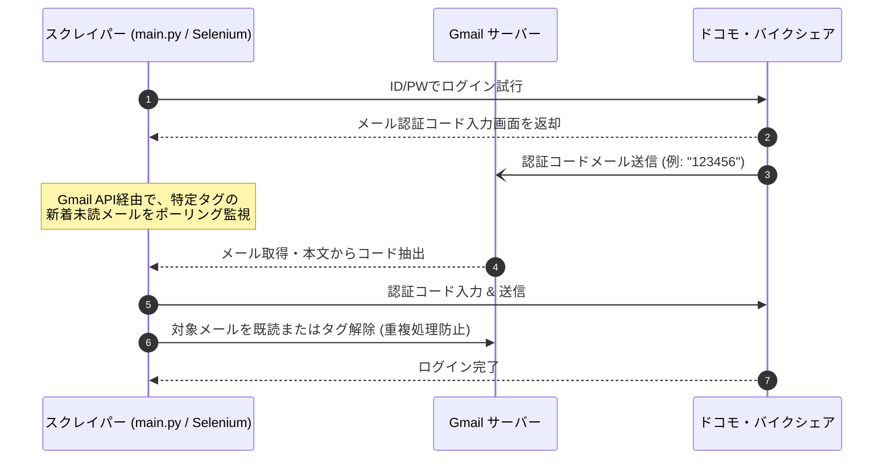

# SMS・メール 2段階認証 自動化対応の設計・実装計画

8月のドコモ・バイクシェアシステム刷新に伴い導入が予定されている、2段階認証への自動化対応に向けた計画書です。

---

## ユーザーレビュー要求事項

> [!IMPORTANT]
> **Gmail 認証コード自動取得（OAuth2 連携）の準備**
> - 今回のシステム刷新において、認証コードをメール（Gmail）で受け取れる仕様になることが判明したため、最も安定しスマートフォンが不要な「Gmail API直接連携」を採用します。
> - 8月の刷新後、ユーザー様の環境で Google Cloud Console にアクセスし、Gmail API の有効化および OAuth2 用の認証情報ファイル（`credentials.json`）の作成を行っていただく必要があります。

> [!WARNING]
> **SMS送信回数およびセッション仕様の不確定要素と回避方針**
> - 事前調査により、現行システムはセッション管理に Cookie を一切使用せず、HTML内の `<input type="hidden" name="SessionID">` を用いたフォームベース of セッション管理を行っていることが判明しました。
> - この仕様のままシステム刷新が行われた場合、ブラウザを終了するたびにセッションが切れて毎回ログイン（および2段階認証）が要求されるため、都度起動（タスクスケジューラ）は破綻します。
> - したがって、刷新後のセッション仕様に応じて以下の2つのシナリオで稼働させます。

### スクレイピング起動方式の検討（タスクスケジューラ vs 常駐化）

セッション切れを防ぎ、2段階認証の頻度を抑える観点から、タスク起動方式について以下の2案を比較・検討します。

| 項目 | 案A：都度起動（タスクスケジューラ / 現行維持） | 案B：常駐起動（デーモン・サービス化） |
| :--- | :--- | :--- |
| **概要** | 5分ごとにプロセスとChromeを都度起動し、クッキーファイルを読み込んでセッション復元を試みる。 | 常時Pythonを起動したままにし、Seleniumブラウザも起動しっぱなしにする。5分おきに同一タブ内でページ遷移しスクレイプする。 |
| **メリット** | ・メモリリークやゾンビブラウザの心配がなく、動作が安定する。 ・タスクスケジューラ側の既存運用を変更しなくてよい。 | ・ブラウザプロセスが常に稼働しているため、Cookieだけでなくブラウザのメモリセッションも完全に維持され、SMS/メール認証の発生頻度が極めて低くなる。 |
| **デメリット** | ・毎回ブラウザを終了するため、ドコモ側の仕様によってはセッションが切れやすく、ログイン頻度（認証送信頻度）が高くなる懸念がある。 | ・ChromeやWebDriverが稀にハングアップする可能性があり、その際の検知・自動再起動ロジックの実装コストが上がる。 |

#### 刷新後の分岐シナリオ
* **シナリオ1：刷新後、近代的な Cookie / JWT ベースのセッション管理に移行した場合**
  * 当初想定していた **「案A（都度起動＋Cookie/プロファイル永続化）」** が機能します。まずはこのアプローチで5分おき都度実行での認証回避を試みます。
* **シナリオ2：刷新後も従来の「フォーム（hiddenパラメータ）ベース」のセッション管理が維持された場合**
  * ブラウザを閉じるとセッション情報が消滅するため、自動的に **「案B（常駐起動・デーモン化）」** が基本線（必須）となります。ブラウザを起動しっぱなしにし、同一タブ内で5分おきに画面遷移させてメモリ上のセッションを維持します。

---

## 2段階認証の自動化方式（SMSからメール/Gmailへの変更）

2段階認証が「メールアドレス（Gmail）へのコード送信」に対応する場合、自動化の設計が格段に安定し、**スマートフォンを完全に排除したサーバーサイド単体での完結**が可能になります。以下の2大アプローチを比較します。

### 案1：Gmail API 直接連携（採用・最推奨・スマートフォン不要・完全自動）

スクレイピングプロセス自体が、直接 Google Gmail API を経由して特定の自動タグ（ラベル）付きの「未読メール」をポーリング監視し、認証コードを自律的に取得します。

* **メリット**:
  * スマートフォンが一切不要。スマホの電源オフ、スリープ、通信圏外といった不確定要素が排除され、100%自動で稼働します。
  * 外部へのポート開放や中継用のFlask APIサーバーも不要になり、セキュリティ制限の厳しい環境（社内ネットワークなど）でもアウトバウンド接続のみで安全に動作します。
* **デメリット**:
  * 初回のみ、Google Cloud ConsoleでGmail API用の認証情報（OAuth2用の `credentials.json`）を作成し、ログイン承認証（トークン生成）を行う必要があります。

### 案2：スマホ（Tasker）中継（Gmail通知検知） 【不採用 / 廃止】

従来のTasker構成を利用し、トリガーを「SMS受信」から「Gmailアプリの新着メール通知（特定タグ）」に切り替えて、Flask APIにPOSTします。

> [!CAUTION]
> **本方式は不採用となりました。**
> メール認証が利用可能な仕様となったため、より堅牢でスマホ依存のない「案1（Gmail API直接連携）」を採用します。
> ユーザー様側のスマートフォン設定（Tasker等の導入）は一切不要となります。

---

## 提案する変更内容

システムの切り替わり後に具体的な要素名（Selector等）を特定して実装しますが、事前の準備として骨組みを作成・整備する方針とします。

### 1. APIサーバー側 (`server.py`) の拡張 【不要 / デバッグ用バックアップ】

> [!NOTE]
> **本番運用では使用しません。**
> スマホ中継方式の不採用に伴い、このAPIエンドポイント拡張は不要となりました。ただし、ローカル環境での手動テストやデバッグ用の裏口として、先行実装したコード（以下）はそのまま `server.py` 上に残しておきます。

- `POST /api/sms-code`: スマホ（Tasker等）からの認証コード登録。
  - 受信したコードをメモリ（スレッドセーフな変数）またはローカルファイル（`sms_code.json`）に保存（タイムスタンプ付きで数分間のみ有効化）。
- `GET /api/sms-code`: スクレイパーからの認証コード取得用。
- `DELETE /api/sms-code`: ログイン成功後に認証コードをクリアするためのエンドポイント。

### 2. スクレイピング処理側 (`src/auth.py` / `src/browser.py`) の拡張

#### [MODIFY] [browser.py](file:///d:/antigravity/DBSgetdata/src/browser.py)
- **Chromeプロファイルの永続化**:
  - 毎回使い捨てのセッションではなく、特定のローカルディレクトリを指定してChromeのユーザーデータを保持する引数（`--user-data-dir`）を有効化し、ブラウザが「信頼済みの端末」として認識される確率を上げます。（※刷新後にCookieベースのセッション管理に移行した場合に有効化します）

#### [MODIFY] [auth.py](file:///d:/antigravity/DBSgetdata/src/auth.py)
- **ログインプロセスの書き換えとセッション（Cookie）永続化**:
  - **将来的なクラウド移行を見据えた設計**: セッション情報（Cookie）を単にローカルブラウザ内に閉じるのではなく、ローカルファイル（例: `output/cookies.json`）として外部にエクスポート・インポートする処理を実装します。これにより、将来クラウド（Cloud Run等の都度消滅する環境）に移行した際も、このCookieファイルを Cloudflare R2 等の共有ストレージと同期させるだけでセッションの引き継ぎが可能になります。（※Cookieベースセッション移行時用）
  - **処理フロー**:
    1. ログイン前に、エクスポートされたCookieファイルが存在すれば読み込み、ブラウザに適用してセッション再利用を試みる。
    2. 有効なセッションであればログイン処理（および認証）全体をスキップ。
    3. 新規ログイン（ID/PW送信後）に成功した場合、最新のCookieをファイルにエクスポート保存する。
    4. 2段階認証画面への遷移を検知した場合は、Gmail APIを通じて数秒おきに特定タグの未読メールをポーリング監視し、コードが届き次第入力。ログイン完了後に最新Cookieを保存。

---

## 段階的ロードマップ (刷新時〜リリース)

まだシステム切り替わり前のため、以下のように段階を踏んで進めます。

### フェーズ1：事前準備（現行システム稼働中）
> [!NOTE]
> 本フェーズで行う実装および検証は、現在5分おきに動作している本番スクレイピング処理（`main.py` などの本番スケジュール）に**一切の影響を与えない**形で安全に進めます。
1. 本計画書による方針決定。
2. Flask API (`server.py`) への新規エンドポイント（認証コード中継用）の先行実装。（既存のエンドポイントや処理には干渉しません。デバッグ用として残します）
3. **独立したテストスクリプト（本番とは別ファイル）**を用いた、Chromeプロファイル永続化およびCookie保存・復元ロジックの動作検証。（※検証の結果、現行システムはCookieを使用しないフォーム隠しパラメータ `SessionID` 依存の仕様であることを特定）
4. （オプション・Gmail API利用時）Google Cloud Consoleでのプロジェクト作成および `credentials.json` の作成・検証。

### フェーズ2：刷新直後（8月）の初期調査
1. 手動またはデバッグ用ノンヘッドレスブラウザで、刷新後の新ログイン画面および**マイページ/車両情報画面等のHTML構造・URL遷移・Cookieの挙動**を調査。
2. 「セッション維持によるメール認証回避が可能か」「ログイン方式（Cookieベースか、フォームベースか）」の検証。
3. **WEBサイト構成の刷新に伴う、スクレイピング対象（HTMLの表構造、Selector、URL等）への影響を調査・確認。**

### フェーズ3：自動化実装・統合テスト
1. 新ログイン画面の要素（Selector）に合わせた `src/auth.py` の修正。
2. **Gmail API を用いた認証コード自動取得モジュール（`src/gmail_client.py` 等）の新規作成とポーリング処理の組み込み。**
3. **新WEBサイト構成に対応したスクレイピングロジック（`src/scraper.py` 等の要素解析・データ抽出処理）の修正。**
4. 模擬メールを用いた自動中継フローの総合テストとチューニング（タイムアウト時間やウェイトの調整）。

---

## 疎通テスト・検証計画

### 自動テスト
- 新たに追加する Gmail API 連携モジュールのユニットテスト。
- 模擬的にGmail APIレスポンスをモックし、Seleniumがタイムアウトせずに読み込むログインロジックのテスト。
